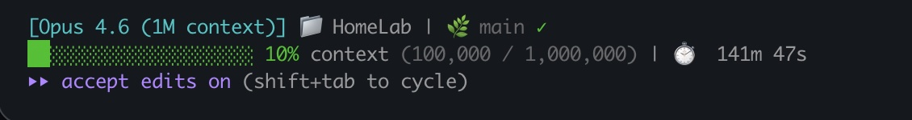

# Claude Code Custom Statusline

A status bar for Claude Code that shows you what's going on at a glance — how much context you've used, what model you're on, which project and branch you're in, and whether Claude's servers are healthy.



**What you're looking at:**
- **`[Opus 4.6 (1M context)]`** — the model and context window you're using
- **`HomeLab | main`** — your current project folder and git branch
- **Server status icon** — live check on Claude Code's servers:
  - **Green check mark (✓)** — everything's working normally
  - **Yellow half-circle (◐)** — servers are up but slower than usual
  - **Yellow warning (⚠)** — partial outage, some features may not work
  - **Red X (✗)** — major outage, Claude Code is down
  - **Gray question mark (?)** — couldn't reach the status page (you're probably fine, it retries every 60 seconds)
- **Progress bar** — how much of your context window you've used, color-coded:
  - **Green** — plenty of room (under 70%)
  - **Yellow** — getting full (70–89%)
  - **Red** — almost out of context (90%+), consider starting a new session
- **`10% context (100,000 / 1,000,000)`** — token count in plain numbers
- **`141m 47s`** — how long your current session has been running

---

## Setup (3 steps, ~2 minutes)

### 1. Install jq (if you don't have it)

The script needs `jq` to read data from Claude Code. Install it:

```bash
# macOS
brew install jq

# Linux
sudo apt install jq
```

Not sure if you have it? Run `which jq` — if it prints a path, you're good.

### 2. Copy the script

Run these two commands in your terminal:

```bash
curl -o ~/.claude/statusline.sh https://raw.githubusercontent.com/MrMister311/claude-code-statusline/main/statusline.sh
chmod +x ~/.claude/statusline.sh
```

The first line downloads the script. The second makes it runnable.

> **Note:** If `~/.claude/` doesn't exist yet, create it first: `mkdir -p ~/.claude`

### 3. Tell Claude Code to use it

Open (or create) `~/.claude/settings.json` and add this:

```json
{
  "statusLine": {
    "type": "command",
    "command": "~/.claude/statusline.sh"
  }
}
```

If you already have a `settings.json` with other stuff in it, just add the `"statusLine"` block inside the existing `{ }` (don't overwrite your other settings).

**That's it.** Start a new Claude Code session and you'll see the statusline appear after your first message.

---

## What Each Part Does

| What you see | What it means |
|---|---|
| `[Opus 4.6]` | Which Claude model is running |
| Folder + branch | Your current project directory and git branch |
| Green/yellow/red bar | Context window usage — green is plenty of room, yellow means you're getting full, red means you're almost out |
| `42% context` | Percentage of context window used |
| `(84,000 / 200,000)` | Tokens used out of total available |
| Timer | How long the current session has been running |
| Check/warning icon | Whether Claude Code's servers are operational (checks automatically) |

---

## Troubleshooting

**Statusline doesn't appear?**
- Make sure the script is executable: `chmod +x ~/.claude/statusline.sh`
- Make sure `jq` is installed: `which jq`
- Make sure your `settings.json` has the `statusLine` block (check for typos)
- The statusline only shows up *after* your first message in a session

**Status icon shows `?` instead of a check mark?**
- That's fine — it just means the status check timed out. It retries every 60 seconds.

**Git branch not showing?**
- You need to be inside a git repo. The branch display updates every 5 seconds.

**Made changes to the script but nothing changed?**
- Updates only appear after Claude sends its next response. Send a message and it'll refresh.

---

## Customizing It

The script is just a bash file — feel free to edit `~/.claude/statusline.sh` to make it your own. Here are some ideas:

### Show your rate limit usage (Pro/Max subscribers)
```bash
rate_5h=$(echo "$input" | jq -r '.rate_limits.five_hour.used_percentage // ""' | cut -d. -f1)
if [ -n "$rate_5h" ] && [ "$rate_5h" != "null" ]; then
    echo -e "${DIM}Rate: ${rate_5h}% (5h)${RESET}"
fi
```

### Show session cost (API key users)
```bash
cost=$(echo "$input" | jq -r '.cost.total_cost_usd // 0')
echo -e "${DIM}Cost: \$${cost}${RESET}"
```

### Show lines of code changed
```bash
added=$(echo "$input" | jq -r '.cost.total_lines_added // 0')
removed=$(echo "$input" | jq -r '.cost.total_lines_removed // 0')
echo -e "${GREEN}+${added}${RESET} ${RED}-${removed}${RESET} lines"
```

### Add a late-night reminder
```bash
hour=$(date +%H)
if [ "$hour" -ge 0 ] && [ "$hour" -lt 6 ]; then
    echo -e "${RED}It's late — consider wrapping up${RESET}"
fi
```

### Want something even simpler?

Skip the script file entirely and put this one-liner in your `settings.json`:
```json
{
  "statusLine": {
    "type": "command",
    "command": "jq -r '\"[\\(.model.display_name)] \\(.context_window.used_percentage // 0 | floor)% context\"'"
  }
}
```

---

## Deep Dive (for the curious)

Everything below is optional reading. You don't need any of this to use the statusline — it's here if you want to understand how it works or build your own from scratch.

### How it works under the hood

1. Every time Claude sends a response, Claude Code runs your statusline script
2. It sends your script a bunch of session data as JSON (model info, token counts, etc.)
3. Your script reads that data, formats it however you want, and prints it out
4. Whatever your script prints becomes the status bar

### Available data from Claude Code

Claude Code sends all of this to your script. You can use any of it:

**Session basics:**

| Field | What it is |
|---|---|
| `model.display_name` | Model name (e.g., "Opus") |
| `model.id` | Model ID (e.g., "claude-opus-4-6") |
| `workspace.current_dir` | Your current directory |
| `session_id` | Unique ID for this session |
| `version` | Claude Code version |

**Context window:**

| Field | What it is |
|---|---|
| `context_window.used_percentage` | How full the context window is (0-100) |
| `context_window.remaining_percentage` | How much room is left (0-100) |
| `context_window.context_window_size` | Total context size in tokens |

**Costs and timing:**

| Field | What it is |
|---|---|
| `cost.total_cost_usd` | Session cost in dollars |
| `cost.total_duration_ms` | Session length in milliseconds |
| `cost.total_lines_added` | Lines of code added |
| `cost.total_lines_removed` | Lines of code removed |

**Rate limits (Pro/Max subscribers only):**

| Field | What it is |
|---|---|
| `rate_limits.five_hour.used_percentage` | 5-hour rate limit usage |
| `rate_limits.seven_day.used_percentage` | 7-day rate limit usage |

### Writing your own in Python

You don't have to use bash. Here's a minimal Python version:

```python
#!/usr/bin/env python3
import json, sys

data = json.load(sys.stdin)
model = data.get("model", {}).get("display_name", "Claude")
pct = int(data.get("context_window", {}).get("used_percentage", 0) or 0)
bar_width = 20
filled = pct * bar_width // 100
bar = "\u2588" * filled + "\u2591" * (bar_width - filled)
print(f"[{model}] {bar} {pct}%")
```

Save it as `~/.claude/statusline.py`, run `chmod +x` on it, and point your settings.json at it instead.

### Things to keep in mind if you're building your own

- **Use `used_percentage`** for context tracking — don't try to calculate it yourself from token counts
- **Cache anything slow** — the script runs after every message, so network calls and git commands should be cached
- **Handle missing data** — some fields are empty before the first API response
- **Keep it fast** — if your script takes longer than ~300ms, it gets cancelled
- **macOS vs Linux** — the `stat` command works differently on each; the included script handles both

---

## License

MIT
